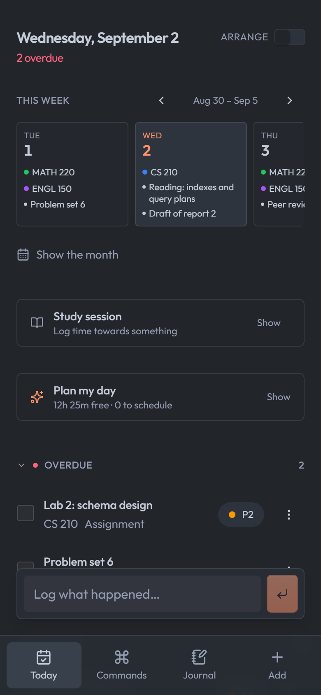
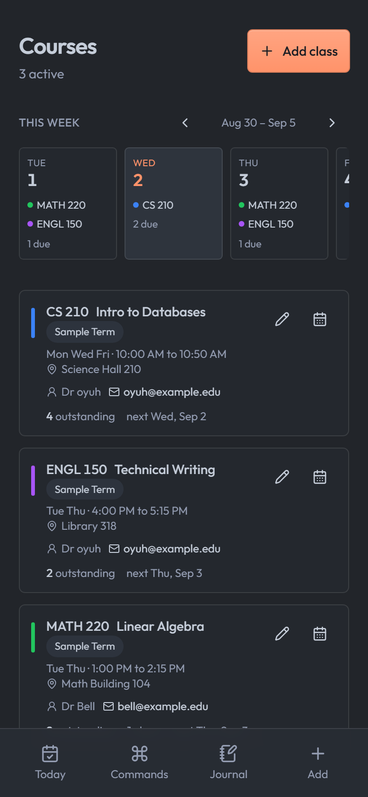
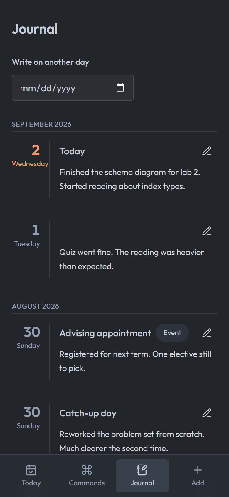
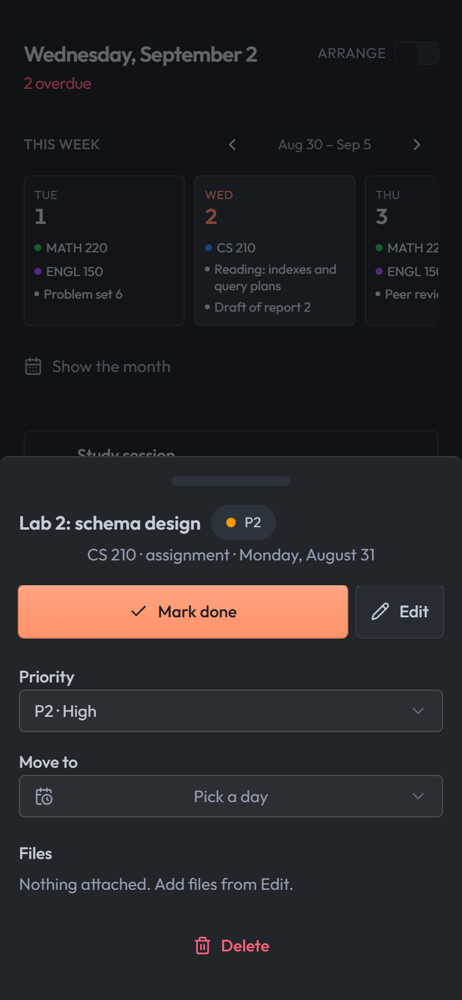
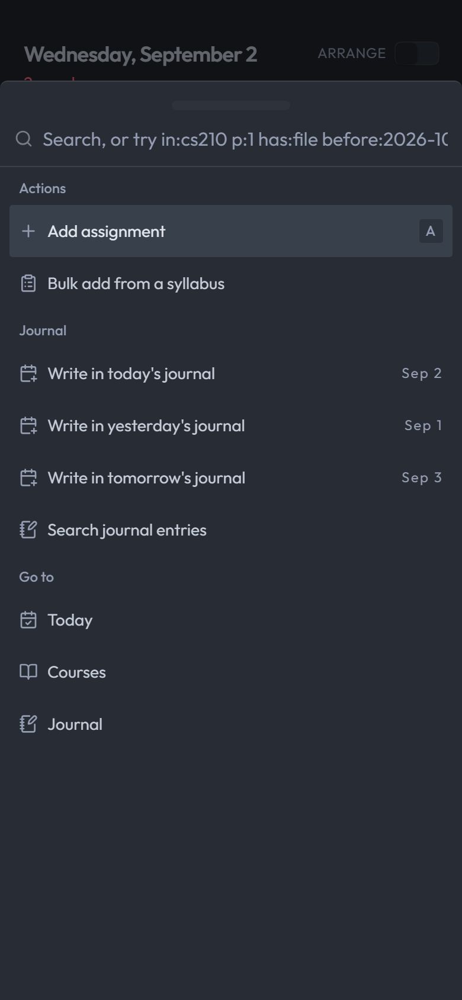
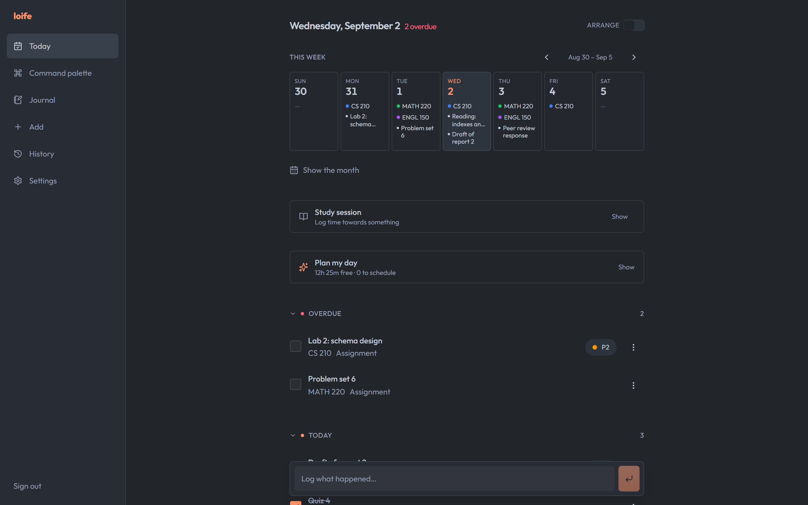

# loife

loife is a single-user school and life dashboard. It tracks courses, assignments, readings and exams, keeps a daily journal, stores file attachments, and pushes due dates into Google Calendar so they land in whatever calendar client you already read. One GitHub account can sign in. Everyone else gets a 403.

I built it to track my own day to day. The code is MIT licensed, so take any part of it you want.

Built for a phone first. The base layout is one column with a bottom tab bar, and rows you swipe sideways for actions. At tablet width and up it becomes a sidebar with dialogs, so a laptop gets the room it has. It installs as a PWA if you want it on a home screen, and nothing is hidden on any size.

<details>
<summary><strong>Contents</strong></summary>

- [What you get](#what-you-get)
- [Screenshots](#screenshots)
- [Requirements](#requirements)
- [Running it locally](#running-it-locally)
- [Configuration](#configuration)
- [Deploying](#deploying)
  - [Railway](#railway)
  - [Free and cheaper hosts](#free-and-cheaper-hosts)
  - [Free Postgres](#free-postgres)
  - [Free file storage](#free-file-storage)
- [Technical notes](#technical-notes)
  - [Stack](#stack)
  - [Scripts](#scripts)
  - [Auth](#auth)
  - [Migrations on deploy](#migrations-on-deploy)
  - [Running against Docker](#running-against-docker)
  - [Checks](#checks)
  - [Time zones](#time-zones)
  - [Icons](#icons)
- [License](#license)

</details>

## What you get

- A Today view that buckets items into overdue, today, this week and later
- Courses with meeting days, term dates, rooms and instructor contacts
- A journal with per-day entries, events and course links
- File attachments on items and journal entries, stored in a private S3 bucket
- Google Calendar sync onto a dedicated calendar named `loife`, never your primary one
- A command palette and a history page that share one filter language
- A syllabus parser that turns pasted dates into draft items
- Light and dark themes, both checked against a 4.5:1 contrast floor

## Screenshots

Phone screens at 390x844, captured against the seeded demo database. The wide
shot at the bottom is the same build at 1440px.

| Today | Courses | Journal |
|---|---|---|
|  |  |  |

| Item detail | Command palette |
|---|---|
|  |  |

The same app on a wider screen, where the tab bar becomes a sidebar:



## Requirements

Three things are required:

- Node 22 or newer, and pnpm
- Postgres 16 or newer
- A GitHub OAuth app, which is how you sign in

Two more turn on optional features:

- An S3 compatible bucket, such as Cloudflare R2, for file attachments
- A Google Cloud project with the Calendar API enabled, for calendar sync

Docker covers Postgres and the bucket while you look around, so you can defer both. See [running against Docker](#running-against-docker).

## Running it locally

1. Install the dependencies and copy the environment template:

   ```bash
   pnpm install && cp .env.example .env
   ```

2. Generate a session secret and paste it into `.env` as `SESSION_SECRET`:

   ```bash
   node -e "console.log(require('crypto').randomBytes(32).toString('base64url'))"
   ```

3. Create a GitHub OAuth app at [github.com/settings/developers](https://github.com/settings/developers). Set the callback URL to `http://localhost:3000/api/auth/callback`. Copy the client ID and secret into `.env`.

4. Find your numeric GitHub account ID and set it as `ALLOWED_GITHUB_ID`:

   ```bash
   curl -s https://api.github.com/users/your_github_username_here
   ```

5. Point `DATABASE_URL` at a Postgres database, then apply the schema:

   ```bash
   pnpm db:migrate
   ```

6. Start the dev server:

   ```bash
   pnpm dev
   ```

The app runs at `http://localhost:3000`.

To fill the database with sample courses, items and journal entries, run `pnpm db:seed`. It writes three courses and ten items spread across overdue, today, this week and later, so every bucket on the Today view has something in it. It refuses to run against any host other than localhost.

## Configuration

Every variable lives in [.env.example](./.env.example) with a comment. The ones you cannot skip:

| Variable | What it is |
|---|---|
| `PUBLIC_URL` | Base URL of this deployment, no trailing slash. Drives both OAuth redirect URIs |
| `SESSION_SECRET` | 32 characters or more. Seals the session cookie |
| `GITHUB_CLIENT_ID`, `GITHUB_CLIENT_SECRET` | From your GitHub OAuth app |
| `ALLOWED_GITHUB_ID` | The one numeric GitHub account ID allowed to sign in |
| `DATABASE_URL` | Postgres connection string |
| `TZ` | Your IANA zone, such as `America/Chicago`. Day boundaries come from it |

Optional, and the features they unlock:

| Variable | Unlocks |
|---|---|
| `GOOGLE_CLIENT_ID`, `GOOGLE_CLIENT_SECRET` | Calendar sync |
| `R2_ACCOUNT_ID`, `R2_ACCESS_KEY_ID`, `R2_SECRET_ACCESS_KEY`, `R2_BUCKET` | File attachments |
| `R2_ENDPOINT` | Points the S3 client at a self-hosted bucket instead of Cloudflare |

An OAuth app holds one callback URL at a time. Keep a second GitHub OAuth app pointed at `http://localhost:3000/api/auth/callback` so local development survives a deploy, and give each environment its own client ID and secret.

If you deploy to a different zone from the one you live in, change `DISPLAY_TIME_ZONE` in [src/lib/datetime.ts](./src/lib/datetime.ts) to match `TZ`. The two have to name the same zone, or a server-rendered page flips its dates on hydration.

## Deploying

The build produces a plain Node server at `.output/server/index.mjs`, so any host that runs a long-lived Node process will do. There is no Dockerfile and no platform config file to keep in sync.

Two commands are all a host needs:

```bash
pnpm build && pnpm start
```

`pnpm start` applies pending migrations before it boots the server, so a schema change ships with the code that needs it.

### Railway

This is what the repo was set up against.

1. Create a project and pick **Deploy from GitHub repo**, then your fork.
2. Add the Postgres plugin. Railway injects `DATABASE_URL` into the service for you.
3. Railway detects pnpm and runs `pnpm build`, then `pnpm start`.
4. Add every variable from `.env.example` under **Variables**. Generate a `SESSION_SECRET` different from your local one.
5. Under **Settings → Networking**, add a custom domain and point a CNAME at the target Railway gives you.
6. Wait for the certificate to issue before you sign in. The session cookie sets `Secure` in production and will not survive plain HTTP.
7. Set `PUBLIC_URL` to that domain with no trailing slash. It drives the OAuth redirect URI, so the `.up.railway.app` subdomain stops working once the custom domain is live.
8. Set your GitHub OAuth app callback to `https://your_domain_here/api/auth/callback`, and the Google one to `https://your_domain_here/api/google/callback`.

Railway bills by usage and has no free tier. The hosts below do.

### Free and cheaper hosts

These tiers change often. Read the current pricing page before you commit to one.

| Host | How it fits |
|---|---|
| [Render](https://render.com) | Free web service tier. It sleeps when idle, so the first request after a gap waits out a cold start of up to a minute. Fine for a dashboard you open a few times a day |
| [Fly.io](https://fly.io) | Runs the Node process in a small VM near you, billed by usage on the smallest shared-CPU machine. You attach Postgres yourself |
| [Koyeb](https://koyeb.com) | Free instance tier with no sleep. Deploys straight from a GitHub repo |
| [Zeabur](https://zeabur.com), [Northflank](https://northflank.com) | The same shape as Railway, each with a free tier |
| A VPS you already rent | Clone, `pnpm build`, then run `pnpm start` under systemd or PM2. [docker-compose.yml](./docker-compose.yml) already defines Postgres and a bucket |

Vercel, Netlify and Cloudflare Pages need extra work. They run functions rather than a long-lived server, so you would swap the Nitro preset in [vite.config.ts](./vite.config.ts) and move `pnpm start`'s migration step somewhere else. Nothing in the app blocks it. Nobody has tried it.

### Free Postgres

None of the hosts above have to supply the database. Point `DATABASE_URL` anywhere:

- [Neon](https://neon.tech) has a free serverless Postgres tier and scales to zero between requests
- [Supabase](https://supabase.com) has a free Postgres project, with a dashboard on top
- [Xata](https://xata.io) and [Prisma Postgres](https://www.prisma.io/postgres) both offer free tiers

The app talks plain Postgres through Drizzle, so any of these work with a connection string and nothing else.

### Free file storage

Attachments go through the S3 API, so the bucket is yours to choose:

- [Cloudflare R2](https://developers.cloudflare.com/r2/) is what the code targets by default. Its free tier covers 10 GB and charges nothing for egress
- Any S3 compatible provider works if you set `R2_ENDPOINT`. Backblaze B2, Wasabi and a self-hosted MinIO all speak the same API
- Leave the four `R2_*` variables unset to run without attachments

## Technical notes

How the app is built, for anyone reading the source rather than running it.

### Stack

| Layer | Choice |
|---|---|
| Framework | TanStack Start v1 on Vite, React 19, TypeScript |
| Routing and data | TanStack Router, TanStack Query v5 |
| Styling | Tailwind v4, one CSS import and no config file |
| Components | shadcn/ui base, kibo-ui registry on top |
| Database | Postgres, Drizzle ORM, drizzle-kit migrations |
| Calendar | Google Calendar API v3 over `fetch` |
| File storage | S3 API via `@aws-sdk/client-s3` |
| Auth | Hand-rolled OAuth over `fetch`, sessions sealed by TanStack Start |
| Lint and format | Biome |

Route files under `src/routes` drive the router, `src/server` holds the server functions, and `src/lib` holds the pure logic the check scripts exercise. Components come from [shadcn/ui](https://ui.shadcn.com) with the [kibo-ui](https://www.kibo-ui.com) registry on top.

### Scripts

| Command | Does |
|---|---|
| `pnpm dev` | Dev server on port 3000 |
| `pnpm build` | Production build into `.output` |
| `pnpm start` | Migrate, then run the built server |
| `pnpm check` | Biome lint and format check |
| `pnpm generate-routes` | Regenerate `routeTree.gen.ts` |
| `pnpm db:generate` | Write a migration from a schema change |
| `pnpm db:migrate` | Apply pending migrations |
| `pnpm db:studio` | Open Drizzle Studio |
| `pnpm db:seed` | Fill a local database with sample data |
| `pnpm local:up` | Start the Docker stack, described below |

### Auth

One user. The GitHub callback compares the numeric account ID against `ALLOWED_GITHUB_ID` and answers 403 for anything else. The ID is used rather than the username, because GitHub lets a username be changed and then claimed by someone else.

Sessions are sealed cookies from TanStack Start's `useSession`, which handles the encryption and the signing.

### Migrations on deploy

The `start` script runs [scripts/migrate.mjs](./scripts/migrate.mjs) before the server boots:

```bash
node scripts/migrate.mjs && node .output/server/index.mjs
```

Migrations therefore apply inside the host's private network, where `DATABASE_URL` resolves, so Postgres needs no public TCP proxy. A failed migration stops the boot rather than serving traffic against a schema that does not match the code.

The script uses drizzle-orm's migrator rather than the drizzle-kit CLI, because drizzle-kit is a devDependency and a production image may prune it.

Railway's `railway.json` pre-deploy command was the first approach and it never executed, so it was dropped. Chaining into `start` is host agnostic and needs no platform config, which is why the app deploys anywhere.

This assumes one replica. Several would race to migrate on boot, so move this back to a single pre-deploy step before you scale up.

### Running against Docker

Docker runs Postgres and a MinIO container that stands in for R2:

```bash
pnpm local:up
```

That starts both containers, waits for their healthchecks, creates the bucket, and applies migrations. Then start the app against them:

```bash
pnpm local:dev
```

| Command | Does |
|---|---|
| `pnpm local:up` | Start the containers and migrate |
| `pnpm local:dev` | Run the dev server against the containers |
| `pnpm local:down` | Stop the containers, keeping the data |
| `pnpm local:down --clean` | Stop them and drop the volumes |
| `pnpm local:restart` | Down, then up |

`local:dev` passes the container connection strings through the environment and never reads `.env`. Keep your production credentials in `.env` for `pnpm dev`, and reach for `local:dev` when you want a session that cannot touch either.

Postgres listens on 5433, because an installed Postgres already holds 5432. Browse the bucket at `http://localhost:9001` with `loife` / `loifelocal`.

### Checks

None of these need Docker or a database you started yourself. `db:check` boots an in-process Postgres and throws it away.

| Command | Covers |
|---|---|
| `pnpm db:check` | Migrations apply, and constraints reject bad rows |
| `pnpm check:dates` | Today view bucketing, ordering and grace periods |
| `pnpm check:datetime` | Site-wide date and time formatting |
| `pnpm check:search` | The filter language shared by the palette and history |
| `pnpm check:contrast` | Every theme text pair clears 4.5:1 |
| `pnpm check:layout` | The Today page's saved section order |
| `pnpm check:plan` | Day planning and busy windows |
| `pnpm check:schedule` | Course meeting patterns and recurrence |
| `pnpm check:syllabus` | Parsing dates out of pasted syllabus text |
| `pnpm check:journal` | Journal line parsing |
| `pnpm check:time` | Reading a typed time six ways |
| `pnpm check` | Biome lint and format |

`check:contrast` reads the theme tokens straight out of [src/styles.css](./src/styles.css) and asserts every text pair clears 4.5:1. The palette is hand-picked from a VS Code theme, so nothing about it is legible by accident.

`check:layout` covers disagreements between what a browser saved and what the current build knows about. None of them are reachable from the UI.

`check:search` covers the date formats, the completion and duration filters, and the rule that a key whose value cannot be read falls back to free text rather than becoming no filter at all.

### Time zones

The display zone is pinned in [src/lib/datetime.ts](./src/lib/datetime.ts) rather than read from the browser. One person's calendar should read the same on a laptop and on a phone carried to another state. `TZ` does the same for the server, and the two have to agree.

### Icons

`public/` holds one wordmark in six shapes: `favicon.svg`, `favicon.ico` (16/32/48), `apple-touch-icon.png`, and the three the manifest points at. All of them are the word "loife" traced out of Outfit at weight 800 with -0.02em of tracking, in `--primary`.

They are generated, not drawn, and nothing in this repo generates them. There is no Python toolchain here to hang a script off. To redo them after changing the font, the weight or `--primary`, take the Outfit variable TTF from google/fonts and walk the glyphs with `fontTools`. Use `SVGPathPen` for the svg and `FreeTypePen` for the raster sizes. [src/components/wordmark.tsx](./src/components/wordmark.tsx) renders the same letters as live text and has to be kept in step by hand.

The svg and the two png sizes the manifest calls "any" are transparent. The apple touch icon and the maskable icon are not, because iOS composites alpha onto black and Android's mask wants a full bleed. Those two sit on `--background`.

## License

MIT. See [LICENSE](./LICENSE). Copy whatever is useful.
